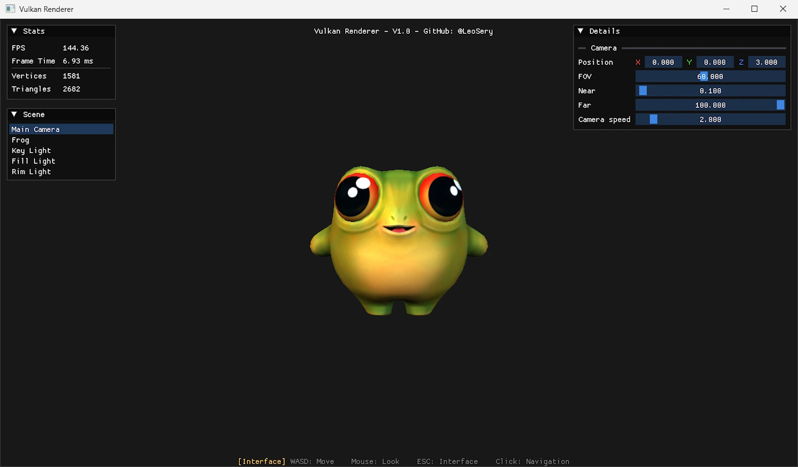
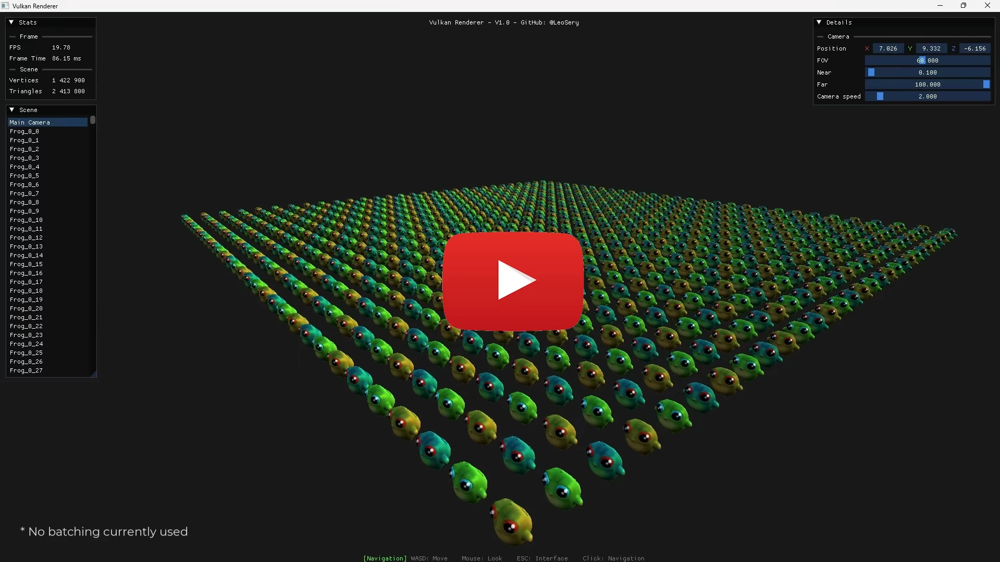
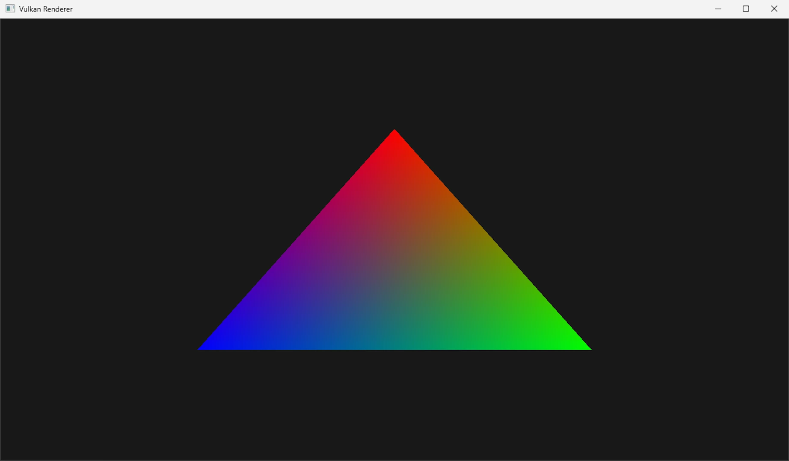
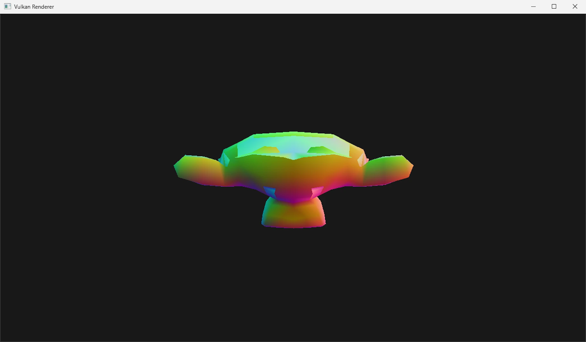
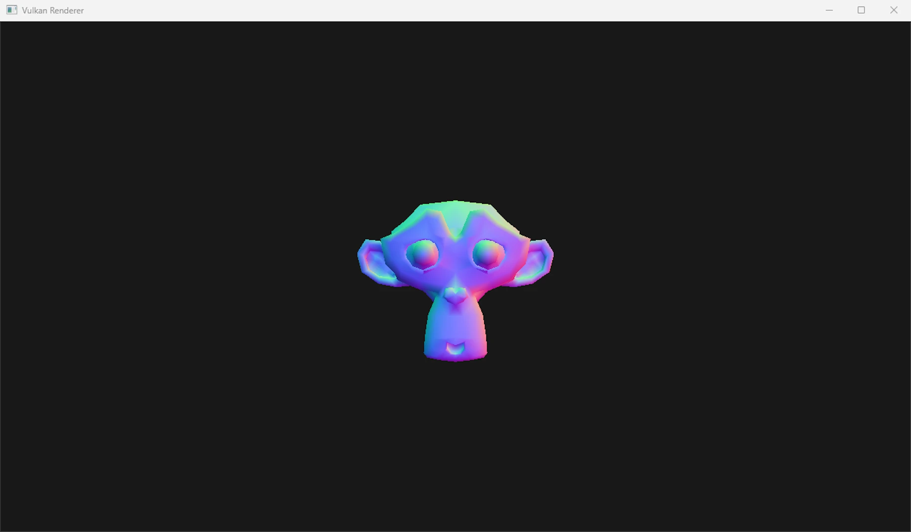
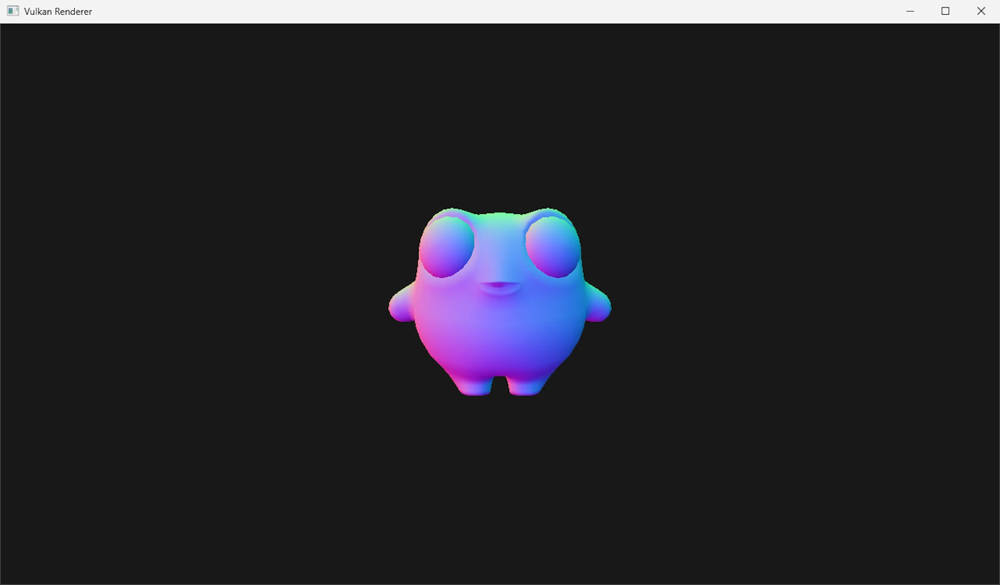
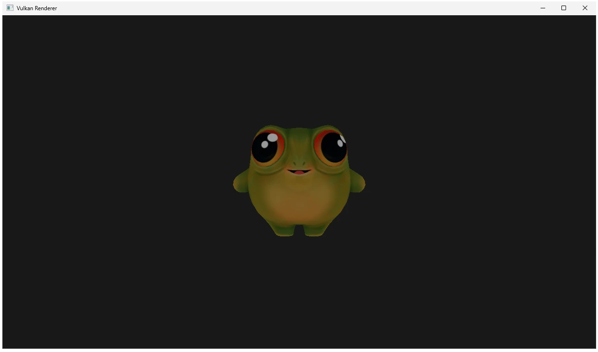
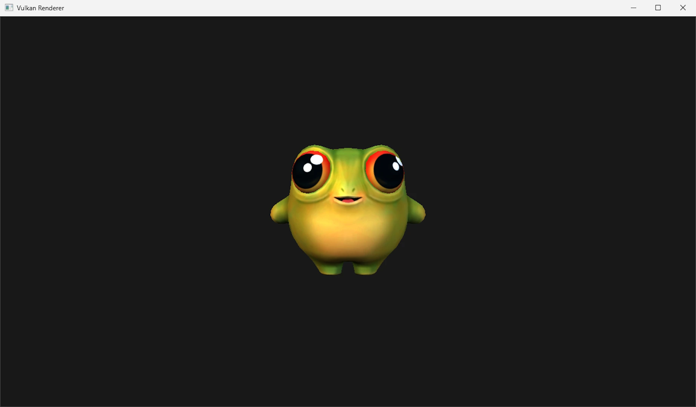

# VulkanRenderer-CPP-2026

VulkanRenderer-CPP-2026 is a Vulkan 1.3 renderer built from scratch in C++. It started as a personal project to explore graphics programming and understand how rendering systems work under the hood of a game engine, from GPU memory management to pipeline synchronization and shader execution. The project began as a university course renderer and was fully rewritten to go deeper into the Vulkan API and build something clean from the ground up.



## Summary :

- [Overview](#overview)
- [Demo](#demo)
- [Technical](#technical)
- [API Usage](#api-usage)
- [How to Use the Project](#how-to-use-the-project)
- [Possible Improvements](#possible-improvements)

## Overview :

The renderer exposes a high-level API (`GraphicsRenderer`, `Scene`, `RenderObject`, `Light`) that hides Vulkan complexity behind typed C++ abstractions. The internal architecture uses strict Pimpl throughout to keep implementation state isolated from public headers.

## Demo :

[](https://www.youtube.com/watch?v=XLhzgoPBucs)

### Development Progression :

- **First triangle :**



- **Displaying the first mesh :**



- **Adding an MVP (Model, View, Projection) matrix and displaying normals :**



- **Adding a custom mesh from a [previous Game Jam project](https://www.leosery.com/projects/frog-this-way) :**



- **Adding a texture to the mesh :**



- **Adding a “3-Point” lighting setup with `Key`, `Fill`, and `Rim` lights :**



- **Adding ImGui to provide a debug interface for the user :**


| Step | Result |
|------|--------|
| Shaders + Pipeline | First colored triangle |
| Buffer + Image + Descriptor + Sampler | Textured quad (UV debug) |
| Mesh loading | First OBJ with normals-as-color |
| Camera + MVP + Depth | Perspective + FPS navigation |
| Blinn-Phong lighting | Directional light on mesh |
| UBO + ImageLoader | Custom mesh with diffuse texture |
| ImGui | Stats / Scene / Details debug panels |
| Scene API | Multi-object, multi-light scene |

### Stress test :

To explore the rendering limits of the current architecture, the same mesh was duplicated in a grid layout with three texture variants distributed across objects.

| Grid | Objects | Vertices | Triangles | FPS |
|------|---------|----------|-----------|-----|
| 12×12 | 144 | ~228 000 | ~386 000 | 144 (stable) |
| 20×20 | 400 | ~632 000 | ~1 072 000 | ~80 |
| 35×35 | 1 225 | 1 936 725 | 3 285 450 | ~22 |

These tests were run without any instancing or resource sharing. Each object owns its own GPU allocation and generates its own draw call. The goal of this project was to understand the fundamentals of a rendering pipeline, not to build a production-ready renderer. Implementing GPU instancing and mesh/texture caching would be the natural next steps to push these numbers further.

## Technical :

- OBJ mesh loading via rapidobj
- Auto-generated mipmaps for textures
- Blinn-Phong shading with up to 8 directional lights
- FPS camera (WASD + mouse look)
- Swapchain recreation on resize
- ImGui debug panels (Stats, Scene, Details)

### Pimpl architecture

Every class (Buffer, Image, Mesh, Shader, Pipeline...) forward-declares an `Impl` struct held via `unique_ptr`. Implementation state lives inside the `Impl` and never leaks out. Public headers expose typed Vulkan handles via getters (`GetVkBuffer()`, `GetVkImageView()`...) when client code needs them.

```cpp
class Buffer
{
public:
    Buffer(GraphicsContext& ctx, const CreateInfos& infos);
    ~Buffer() noexcept;

    void Upload(const void* data, VkDeviceSize size);
    VkBuffer GetVkBuffer() const;

private:
    struct Impl;
    std::unique_ptr<Impl> m_pImpl;
};
```

### Intermediate backbuffer

The renderer does not draw directly into the swapchain image. It renders into an intermediate `R16G16B16A16_SFLOAT` backbuffer, then blits to the `B8G8R8A8_UNORM` swapchain image for presentation. This decouples the render format from the swapchain format and makes the pipeline HDR-capable.

### Vertex input reflection via SPIRV-Reflect

The vertex input layout is not hardcoded. The `Shader` class reads the SPIR-V bytecode at load time and extracts vertex attributes automatically via `spvReflectEnumerateInputVariables`. If the shader changes, the pipeline adapts without touching any C++ code.

### Descriptor sets by update frequency

Set=0 holds the per-frame scene UBO (camera matrices + light array), updated once per frame. Set=1 holds the per-object texture sampler, bound at each draw call. This split minimizes unnecessary descriptor rebinds at runtime.

## API Usage :

```cpp
#include "VulkanRenderer.h"

int main()
{
    GraphicsRenderer application("Vulkan Renderer", 1280, 720);

    Scene& mainScene = application.GetScene();
    mainScene.GetCamera().SetPosition({ 0.0f, 0.0f, 3.0f });
    mainScene.GetCamera().SetRotation(-90.0f, 0.0f);

    // 3D Frog Model
    RenderObject* frogObject = mainScene.AddObject("Frog");
    frogObject->SetMesh("assets/Meshs/FrogThisWay/Frog.obj");
    frogObject->SetTexture("assets/Textures/FrogThisWay/Tx_Frogv1_D.jpg");
    frogObject->SetRotation(0.0f, 0.0f, 0.0f);

    RenderObject* frogObject2 = mainScene.AddObject("Frog2");
    frogObject2->SetMesh("assets/Meshs/FrogThisWay/Frog.obj");
    frogObject2->SetTexture("assets/Textures/FrogThisWay/Tx_Frogv1_D.jpg");
    frogObject2->SetRotation(3.0f, 0.0f, 0.0f);

    // Key light > warm, main, high front-right
    Light* keyLight = mainScene.AddLight("Key Light");
    keyLight->SetDirection(0.639f, 0.426f, 0.639f);
    keyLight->SetColor(1.0f, 0.92f, 0.78f);    // Warm white, slightly golden
    keyLight->SetAmbientStrength(0.15f);
    keyLight->SetSpecularStrength(0.5f);
    keyLight->SetShininess(32.0f);

    // Fill light > cool, soft, front-left
    Light* fillLight = mainScene.AddLight("Fill Light");
    fillLight->SetDirection(-0.534f, 0.267f, 0.801f);
    fillLight->SetColor(0.7f, 0.82f, 1.0f);    // Slightly blueish white, cool
    fillLight->SetAmbientStrength(0.0f);
    fillLight->SetSpecularStrength(0.1f);
    fillLight->SetShininess(16.0f);

    // Rim light > neutral, high from behind, outline
    Light* rimLight = mainScene.AddLight("Rim Light");
    rimLight->SetDirection(0.0f, 0.8f, -0.6f);
    rimLight->SetColor(0.4f, 0.52f, 0.65f);    // Pale cool blue, cinematic rim
    rimLight->SetAmbientStrength(0.0f);
    rimLight->SetSpecularStrength(0.5f);
    rimLight->SetShininess(64.0f);

    application.Run();
    return 0;
}
```

**Camera**

| Method | Description |
|--------|-------------|
| `SetPosition(vec3)` | World position |
| `SetRotation(yaw, pitch)` | Horizontal and vertical angle in degrees (pitch clamped to -89/89) |
| `SetFOV(float)` | Field of view in degrees |
| `SetNearPlane(float)` | Near clipping distance |
| `SetFarPlane(float)` | Far clipping distance |

**RenderObject**

| Method | Description |
|--------|-------------|
| `SetMesh(path)` | Path to an `.obj` file |
| `SetTexture(path)` | Path to an image file (JPG, PNG) |
| `SetPosition(x, y, z)` | World position |
| `SetRotation(pitch, yaw, roll)` | Euler angles in degrees, applied in YXZ order |
| `SetScale(x, y, z)` | Scale multiplier per axis |

**Light** (directional)

| Method | Description |
|--------|-------------|
| `SetDirection(x, y, z)` | Direction vector the light points toward |
| `SetColor(r, g, b)` | RGB color (0-1) |
| `SetAmbientStrength(float)` | Ambient component intensity (0-1) |
| `SetSpecularStrength(float)` | Specular highlight intensity (0-1) |
| `SetShininess(float)` | Specular exponent (higher = sharper highlight, 1-128) |

## How to Use the Project :

Required:
- [Visual Studio 2026](https://visualstudio.microsoft.com)
- [Vulkan SDK](https://vulkan.lunarg.com)
- [vcpkg](https://learn.microsoft.com/en-us/vcpkg/get_started/overview) with `vcpkg integrate install` run once

```bash
git clone https://github.com/LeoSery/VulkanRenderer-CPP-2026.git
```

Open `VulkanRenderer.slnx` in VS2022 and build. vcpkg dependencies are installed automatically on first build via the `vcpkg.json` manifest.

Assets (meshes, textures) and pre-compiled SPIR-V shaders are included in the repository, no additional setup required.

## Possible Improvements :

1. Mesh and texture resource caching. Each `RenderObject` currently owns its own GPU allocation; a shared resource manager would allow multiple objects to reuse the same mesh or texture.
2. Shadow mapping (depth pass + PCF filtering)
3. PBR / metallic-roughness workflow to replace Blinn-Phong
4. Deferred rendering (G-buffer pass) for efficient multi-light scenes
5. Screen space ambient occlusion (SSAO)
6. glTF 2.0 loading
7. Frustum culling via compute shader
8. Anti-aliasing (MSAA or TAA)